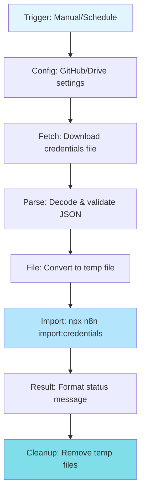

# 🔐 Auto Import n8n Credentials from GitHub Workflows

> **Автоматичний імпорт облікових даних (credentials) в n8n з GitHub та Google Drive**

## 📋 Зміст

- [Про проект](#-про-проект)
- [Швидкий старт](#-швидкий-старт)
- [Файли](#-файли)
- [Як це працює](#-як-це-працює)
- [Вимоги](#-вимоги)
- [Налаштування](#%EF%B8%8F-налаштування)
- [Безпека](#-безпека)
- [Використання](#-використання)
- [Troubleshooting](#-troubleshooting)

---

## 🎯 Про проект

Цей набір n8n workflows дозволяє **автоматично імпортувати credentials** (облікові дані інтеграцій) назад в n8n з backup систем.

### Навіщо це потрібно?

Якщо ви вже використовуєте:
- ✅ Backup workflows → GitHub (експорт робочих процесів)
- ✅ Restore workflows ← GitHub (імпорт робочих процесів)
- ✅ Backup credentials → Google Drive (експорт облікових даних)

То вам не вистачало:
- ⭐ **Import credentials ← GitHub/Drive** (імпорт облікових даних) ← **ОСЬ ВОНО!**

Тепер ви маєте **повний цикл backup/restore** для n8n!

---

## 🚀 Швидкий старт

### За 3 хвилини до запуску:

```bash
# 1. Імпортуйте workflow в n8n
n8n → Workflows → Import from File
→ Виберіть: n8n-import-credentials-from-github.json

# 2. Налаштуйте одну змінну
Node "Globals - Config" → repo.owner = "your-github-username"

# 3. Додайте GitHub credentials
Node "GitHub Get Credentials File" → Select GitHub credentials

# 4. Запустіть!
Execute Workflow
```

📖 **Детальна інструкція**: [QUICKSTART_UA.md](./QUICKSTART_UA.md)

---

## 📦 Файли

| Файл | Опис | Розмір |
|------|------|--------|
| `n8n-import-credentials-from-github.json` | Workflow для імпорту з GitHub | ~12 KB |
| `n8n-import-credentials-from-google-drive.json` | Workflow для імпорту з Google Drive | ~14 KB |
| `N8N_CREDENTIALS_IMPORT_GUIDE.md` | Повна документація (EN) | ~15 KB |
| `QUICKSTART_UA.md` | Швидкий старт (UA) | ~8 KB |
| `CREDENTIALS_IMPORT_README.md` | Цей файл | ~5 KB |

---

## 🔄 Як це працює

### Архітектура



### Процес виконання

```
1️⃣ Trigger запускає workflow (вручну або за розкладом)
    ↓
2️⃣ Завантажується файл credentials з GitHub/Drive
    ↓
3️⃣ JSON декодується і валідується
    ↓
4️⃣ Файл записується у /tmp/ директорію
    ↓
5️⃣ Виконується команда: npx n8n import:credentials --input=/tmp/...
    ↓
6️⃣ Результат форматується і повертається
    ↓
7️⃣ Тимчасові файли видаляються
    ↓
8️⃣ ✅ Credentials імпортовані в n8n!
```

---

## ✅ Вимоги

### Система
- ✅ n8n (self-hosted або cloud)
- ✅ Node.js + npm (для `npx` команд)
- ✅ Доступ до `/tmp` директорії (write permissions)

### Credentials

**Для GitHub варіанту:**
- ✅ GitHub account
- ✅ Personal Access Token з правом `repo`
- ✅ Private repository для backup

**Для Google Drive варіанту:**
- ✅ Google account
- ✅ OAuth2 credentials (Google Cloud Console)
- ✅ Drive API enabled

### Backup файл

Файл повинен бути створений командою:
```bash
npx n8n export:credentials --all --decrypted --output=credentials.json
```

Формат:
```json
[
  {
    "name": "My API Credential",
    "type": "httpBasicAuth",
    "data": {
      "user": "username",
      "password": "password123"
    }
  }
]
```

---

## ⚙️ Налаштування

### Варіант 1: GitHub

#### Крок 1: Створіть GitHub token

```
1. GitHub → Settings → Developer settings
2. Personal access tokens → Tokens (classic)
3. Generate new token
4. Scopes: ✅ repo (Full control of private repositories)
5. Збережіть token
```

#### Крок 2: Налаштуйте workflow

```javascript
Node "Globals - Config":
{
  "repo.owner": "your-username",      // ← Ваш GitHub username
  "repo.name": "n8n-backups",         // ← Назва репозиторію
  "repo.path": "credentials/n8n_backup_credentials.json"  // ← Шлях
}
```

#### Крок 3: Додайте credentials в n8n

```
Node "GitHub Get Credentials File"
→ Click on "Select credential"
→ Create new GitHub API credential
→ Paste your Personal Access Token
```

---

### Варіант 2: Google Drive

#### Крок 1: Google Cloud Console

```
1. console.cloud.google.com
2. Create new project (або виберіть існуючий)
3. Enable "Google Drive API"
4. Create OAuth 2.0 credentials
5. Додайте authorized redirect URI: https://your-n8n-url.com/rest/oauth2-credential/callback
```

#### Крок 2: Знайдіть Folder ID

```
1. Відкрийте папку в браузері
2. URL виглядає так:
   https://drive.google.com/drive/folders/1p447S9MWYcRpA6dmfDe-Kdc3-d8L2Lzr
                                           ^^^^^^^^^^^^^^^^^^^^^^^^^^^^
3. Це і є ваш folderId
```

#### Крок 3: Налаштуйте workflow

```javascript
Node "Globals - Google Drive Config":
{
  "driveId": "My Drive",
  "folderId": "1p447S9MWYcRpA6dmfDe-Kdc3-d8L2Lzr",  // ← Ваш folder ID
  "fileName": "n8n_backup_credentials.json"
}
```

---

## 🛡️ Безпека

### ⚠️ КРИТИЧНО ВАЖЛИВО

Credentials експортуються в **декодованому вигляді** (plaintext)!

### Обов'язкові заходи:

```
✅ ТІЛЬКИ private GitHub repositories
✅ Обмежений доступ до Google Drive папки
✅ НЕ публікуйте файли credentials
✅ Регулярно оновлюйте API keys
✅ Використовуйте 2FA для GitHub/Google accounts
✅ Моніторте access logs
✅ Видаляйте старі backups
```

### Рекомендовано:

```
🔒 Git-Crypt для GitHub repositories
🔒 Client-side encryption для Google Drive
🔒 Використовуйте secrets manager (Vault, AWS Secrets Manager)
🔒 Ротація credentials кожні 90 днів
🔒 Audit trail для всіх операцій
```

### Що НЕ робити:

```
❌ Public GitHub repositories
❌ Uncommitted credentials у коді
❌ Sharing links з credentials файлами
❌ Hardcoded API keys у workflows
❌ Storing в unencrypted storage
```

---

## 💻 Використання

### Ручний запуск

```
1. Відкрийте workflow в n8n
2. Натисніть "Execute Workflow"
3. Дочекайтесь завершення
4. Перевірте результат у "Format Result" node
```

### Автоматичний запуск (Schedule)

**Активуйте Schedule Trigger:**

```javascript
// GitHub варіант - кожні 6 годин
Node "Schedule Trigger (Every 6 hours)"
→ Activate toggle ✅

// Google Drive варіант - кожні 12 годин
Node "Schedule Trigger (Every 12 hours)"
→ Activate toggle ✅
```

**Кастомне розклад:**

```javascript
// Щодня о 3:00 ночі
{
  "rule": {
    "interval": [{
      "field": "cronExpression",
      "expression": "0 3 * * *"
    }]
  }
}

// Щопонеділка о 9:00
{
  "rule": {
    "interval": [{
      "field": "cronExpression",
      "expression": "0 9 * * 1"
    }]
  }
}

// Кожні 2 години
{
  "rule": {
    "interval": [{
      "field": "hours",
      "hoursInterval": 2
    }]
  }
}
```

### Перевірка результату

```javascript
// Output node "Format Result"
{
  "status": "✅ Success",                        // ← Статус
  "message": "Successfully imported 15 credentials",  // ← Повідомлення
  "credentialsCount": 15,                       // ← Кількість
  "timestamp": "2024-01-15T10:30:00.000Z",     // ← Час
  "source": "GitHub"                            // ← Джерело
}
```

---

## 🐛 Troubleshooting

### Проблема: "Command not found: npx"

**Причина**: Node.js не встановлено або npx недоступний

**Рішення**:
```bash
# Перевірте версію
node --version
npm --version

# Якщо не встановлено
sudo apt-get update
sudo apt-get install nodejs npm

# Або через nvm
curl -o- https://raw.githubusercontent.com/nvm-sh/nvm/v0.39.0/install.sh | bash
nvm install node
```

---

### Проблема: "Permission denied: /tmp/"

**Причина**: Немає прав на запис у /tmp

**Рішення 1** - Дайте права:
```bash
sudo chmod 777 /tmp
```

**Рішення 2** - Змініть шлях:
```javascript
// У node "Write to Temp File"
fileName = "/home/n8n/.n8n/temp/temp_credentials_import.json"

// Створіть директорію
mkdir -p /home/n8n/.n8n/temp
chmod 755 /home/n8n/.n8n/temp
```

---

### Проблема: "GitHub API rate limit exceeded"

**Причина**: Перевищено ліміт API requests

**Рішення 1** - Використовуйте authenticated requests (вже налаштовано)

**Рішення 2** - Зменшіть частоту:
```javascript
// Замість кожні 6 годин
hoursInterval: 12  // Кожні 12 годин
```

**Рішення 3** - Переключіться на Google Drive варіант

---

### Проблема: "File not found in GitHub/Drive"

**Причина**: Файл не існує або неправильний шлях

**Діагностика**:
```bash
# Для GitHub
curl -H "Authorization: token YOUR_TOKEN" \
  https://api.github.com/repos/USERNAME/REPO/contents/credentials/

# Для Google Drive
# Перевірте node "Search File" output
```

**Рішення**:
```javascript
// Перевірте шлях у node "Globals"
repo.path = "credentials/n8n_backup_credentials.json"  // ✅ Правильно
repo.path = "/credentials/n8n_backup_credentials.json" // ❌ Неправильно (/ на початку)
```

---

### Проблема: "Invalid credentials format"

**Причина**: Файл має неправильний формат

**Перевірка**:
```bash
# Файл повинен бути JSON array
cat credentials.json | jq 'type'
# Output: "array" ✅

# Кожен елемент повинен мати структуру
cat credentials.json | jq '.[0] | keys'
# Output: ["name", "type", "data"] ✅
```

**Рішення**:
```bash
# Експортуйте знову з правильними параметрами
npx n8n export:credentials --all --decrypted --output=credentials.json
```

---

### Проблема: "Credentials already exist"

**Поведінка**: n8n перезаписує існуючі credentials

**Якщо НЕ хочете перезаписувати**:
```javascript
// Додайте перевірку перед node "Execute Import Command"
// Node "Code" - Check Existing:

const existingCreds = await this.helpers.httpRequest({
  method: 'GET',
  url: 'http://localhost:5678/api/v1/credentials',
  headers: {
    'X-N8N-API-KEY': 'your-api-key'
  }
});

// Фільтруйте тільки нові
const newCreds = $json.credentials.filter(cred => 
  !existingCreds.data.some(existing => 
    existing.name === cred.name && existing.type === cred.type
  )
);

return { json: { credentials: newCreds } };
```

---

### Проблема: "Import succeeds but credentials don't appear"

**Можливі причини**:

1. **Неправильний n8n instance**
```bash
# Перевірте що команда виконується в правильному контексті
echo $N8N_USER_FOLDER
# Має бути: /home/n8n/.n8n
```

2. **Credentials encrypted wrong**
```bash
# Перевірте encryption key
echo $N8N_ENCRYPTION_KEY
# Має бути налаштований
```

3. **Database connection**
```bash
# Перевірте підключення до БД
npx n8n execute --help
# Має працювати без помилок
```

**Рішення**:
```bash
# Запустіть import вручну для тестування
npx n8n import:credentials --input=credentials.json --separate

# Перевірте логи
tail -f ~/.n8n/logs/n8n.log
```

---

## 📊 Моніторинг та Logging

### Базовий моніторинг

Workflow повертає детальний статус:

```javascript
{
  "status": "✅ Success" | "⚠️ Warning",
  "message": "Successfully imported N credentials",
  "credentialsCount": 15,
  "stdout": "Command output...",
  "stderr": "Error output (if any)...",
  "timestamp": "2024-01-15T10:30:00.000Z",
  "source": "GitHub" | "Google Drive"
}
```

### Додати Slack notifications

```javascript
// После node "Format Result" додайте Slack node

// Slack node configuration:
{
  "channel": "#n8n-alerts",
  "text": `
🔐 *Credentials Import*
Status: {{ $json.status }}
Count: {{ $json.credentialsCount }}
Source: {{ $json.source }}
Time: {{ $json.timestamp }}
{{ $json.message }}
  `
}
```

### Додати Email notifications

```javascript
// Send Email node після "Format Result"

{
  "toEmail": "admin@company.com",
  "subject": "n8n Credentials Import: {{ $json.status }}",
  "body": `
Credentials Import Report
========================

Status: {{ $json.status }}
Message: {{ $json.message }}
Credentials Count: {{ $json.credentialsCount }}
Source: {{ $json.source }}
Timestamp: {{ $json.timestamp }}

Stdout:
{{ $json.stdout }}

Stderr:
{{ $json.stderr }}
  `
}
```

### Logging в database

```javascript
// Postgres/MySQL node після "Format Result"

INSERT INTO import_logs (
  status,
  message,
  credentials_count,
  source,
  timestamp,
  stdout,
  stderr
) VALUES (
  '{{ $json.status }}',
  '{{ $json.message }}',
  {{ $json.credentialsCount }},
  '{{ $json.source }}',
  '{{ $json.timestamp }}',
  '{{ $json.stdout }}',
  '{{ $json.stderr }}'
);
```

---

## 🎨 Розширення та кастомізація

### Додати перевірку змін перед імпортом

```javascript
// Node "Code" перед "Execute Import Command"
// Порівняємо з існуючими credentials

const currentCreds = await this.helpers.request({
  method: 'GET',
  uri: 'http://localhost:5678/api/v1/credentials',
  json: true,
  headers: { 'X-N8N-API-KEY': 'your-api-key' }
});

const newCreds = $json.credentials;
const changed = [];

for (const cred of newCreds) {
  const existing = currentCreds.data.find(c => 
    c.name === cred.name && c.type === cred.type
  );
  
  if (!existing || JSON.stringify(existing.data) !== JSON.stringify(cred.data)) {
    changed.push(cred);
  }
}

if (changed.length === 0) {
  // Нічого не змінилось, пропускаємо імпорт
  return { json: { skip: true, message: 'No changes detected' } };
}

return { json: { credentials: changed, skip: false } };
```

### Вибірковий імпорт (тільки певні types)

```javascript
// Node "Code" після "Parse Credentials JSON"

const allCreds = $json.credentials;
const allowedTypes = ['githubApi', 'slackApi', 'googleSheetsOAuth2Api'];

const filteredCreds = allCreds.filter(cred => 
  allowedTypes.includes(cred.type)
);

return { 
  json: { 
    credentials: filteredCreds,
    credentialsString: JSON.stringify(filteredCreds, null, 2),
    originalCount: allCreds.length,
    filteredCount: filteredCreds.length
  } 
};
```

### Версіонування credentials

```javascript
// Створюйте резервні копії перед імпортом
// Node "Execute Command" ПЕРЕД основним імпортом

// Експортуємо поточні credentials
npx n8n export:credentials --all --decrypted \
  --output=/backups/credentials_backup_$(date +%Y%m%d_%H%M%S).json

// Зберігаємо останні 10 версій
cd /backups && ls -t credentials_backup_*.json | tail -n +11 | xargs -r rm
```

---

## 🔗 Інтеграція з CI/CD

### GitHub Actions

```yaml
# .github/workflows/n8n-credentials-sync.yml

name: Sync n8n Credentials

on:
  push:
    paths:
      - 'credentials/**'
  schedule:
    - cron: '0 */6 * * *'  # Every 6 hours

jobs:
  trigger-import:
    runs-on: ubuntu-latest
    steps:
      - name: Trigger n8n import workflow
        run: |
          curl -X POST \
            -H "X-N8N-API-KEY: ${{ secrets.N8N_API_KEY }}" \
            -H "Content-Type: application/json" \
            https://your-n8n-url.com/webhook/import-credentials
```

### GitLab CI

```yaml
# .gitlab-ci.yml

sync-credentials:
  stage: deploy
  only:
    - master
  script:
    - |
      curl -X POST \
        -H "X-N8N-API-KEY: $N8N_API_KEY" \
        https://your-n8n-url.com/webhook/import-credentials
  only:
    changes:
      - credentials/**
```

---

## 📈 Best Practices

### 1. Стратегія backup/restore

```
🔵 PRODUCTION:
├─ Backup:
│  ├─ Workflows → GitHub (кожні 10 хв)
│  └─ Credentials → Google Drive (щодня о 2:00 AM)
└─ Restore:
   ├─ Workflows ← Manual/On-demand
   └─ Credentials ← Manual/Every 12h

🟢 STAGING:
├─ Sync from production (щотижня)
└─ Test restore process

🟡 DEVELOPMENT:
└─ On-demand backup/restore
```

### 2. Access control

```
👤 Roles:
├─ Admin: Full access (backup + restore)
├─ DevOps: Backup + monitoring
└─ Developer: Read-only access to workflows
```

### 3. Retention policy

```
📦 GitHub:
├─ Keep all commits (git history)
└─ Tag important versions

☁️ Google Drive:
├─ Keep last 30 days
├─ Monthly archives for 1 year
└─ Yearly archives forever
```

### 4. Testing

```
✅ Weekly:
├─ Test restore на staging
├─ Verify all credentials work
└─ Document any issues

✅ Monthly:
├─ Full disaster recovery drill
├─ Update documentation
└─ Review access logs
```

---

## 📚 Додаткові ресурси

### Документація

- 📖 [N8N Credentials Import Guide](./N8N_CREDENTIALS_IMPORT_GUIDE.md) - Повна документація
- 🚀 [Quick Start Guide (UA)](./QUICKSTART_UA.md) - Швидкий старт українською
- 🔧 [n8n CLI Documentation](https://docs.n8n.io/hosting/cli-commands/)
- 🔐 [n8n Credentials Documentation](https://docs.n8n.io/credentials/)

### API References

- [GitHub REST API](https://docs.github.com/en/rest)
- [Google Drive API v3](https://developers.google.com/drive/api/v3/about-sdk)
- [n8n API Documentation](https://docs.n8n.io/api/)

### Community

- [n8n Community Forum](https://community.n8n.io/)
- [n8n GitHub Discussions](https://github.com/n8n-io/n8n/discussions)
- [n8n Discord Server](https://discord.gg/n8n)

---

## 🤝 Contributing

Знайшли баг або маєте ідею покращення?

1. Fork repository
2. Create feature branch (`git checkout -b feature/amazing-feature`)
3. Commit changes (`git commit -m 'Add amazing feature'`)
4. Push to branch (`git push origin feature/amazing-feature`)
5. Open Pull Request

---

## 📄 License

Ці workflows є частиною n8n ecosystem.

- n8n Community Edition: [Apache 2.0 License](https://github.com/n8n-io/n8n/blob/master/LICENSE.md)
- n8n Enterprise: [n8n Enterprise License](https://github.com/n8n-io/n8n/blob/master/LICENSE_EE.md)

---

## ⭐ Acknowledgments

Створено на основі існуючих n8n backup workflows:
- Backup Workflows to GitHub
- Restore Workflows from GitHub
- Backup Credentials to Google Drive

Дякуємо n8n community за натхнення та підтримку!

---

## 📞 Support

- 💬 [GitHub Issues](https://github.com/n8n-io/n8n/issues)
- 📧 Email: support@n8n.io
- 💭 [Community Forum](https://community.n8n.io/)

---

**Made with ❤️ for the n8n community**

**Version**: 1.0.0  
**Last Updated**: 2024-01-15  
**Author**: Based on community workflows
