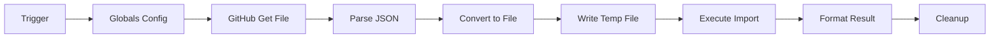
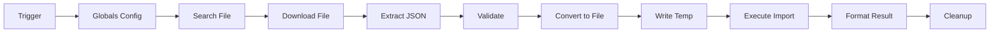

# 🔐 N8N Credentials Auto-Import Workflows

Цей набір workflow дозволяє автоматично імпортувати credentials (облікові дані інтеграцій) в n8n з різних джерел.

## 📦 Що включено

### 1. **n8n-import-credentials-from-github.json**
Workflow для автоматичного імпорту credentials з GitHub репозиторію.

### 2. **n8n-import-credentials-from-google-drive.json**
Workflow для автоматичного імпорту credentials з Google Drive.

---

## 🎯 Навіщо це потрібно?

Цей workflow доповнює ваш існуючий набір для повного backup/restore циклу:

| Workflow | Призначення |
|----------|-------------|
| ✅ Backup Workflows → GitHub | Експорт workflows в GitHub |
| ✅ Restore Workflows ← GitHub | Імпорт workflows з GitHub |
| ✅ Backup Credentials → Google Drive | Експорт credentials в Google Drive |
| ✅ **Import Credentials ← GitHub/Drive** | **НОВИЙ: Імпорт credentials назад в n8n** |

---

## 🚀 Швидкий старт

### Варіант 1: Імпорт з GitHub

1. **Імпортуйте workflow** `n8n-import-credentials-from-github.json` в n8n
2. **Відкрийте node "Globals - Config"** та налаштуйте:
   ```
   repo.owner = "valaqajoya93600"  // Ваш GitHub username
   repo.name = "n8n-backups"        // Назва репозиторію
   repo.path = "credentials/n8n_backup_credentials.json"  // Шлях до файлу
   ```
3. **Налаштуйте GitHub credentials** в node "GitHub Get Credentials File"
4. **Запустіть workflow** вручну або увімкніть Schedule Trigger

### Варіант 2: Імпорт з Google Drive

1. **Імпортуйте workflow** `n8n-import-credentials-from-google-drive.json` в n8n
2. **Відкрийте node "Globals - Google Drive Config"** та налаштуйте:
   ```
   driveId = "My Drive"
   folderId = "1p447S9MWYcRpA6dmfDe-Kdc3-d8L2Lzr"  // ID вашої папки
   fileName = "n8n_backup_credentials.json"
   ```
3. **Налаштуйте Google Drive credentials**
4. **Запустіть workflow**

---

## 📋 Детальний опис роботи

### Workflow з GitHub

#### Процес виконання:



#### Кроки:

1. **Manual/Schedule Trigger** - Запуск workflow
2. **Globals - Config** - Налаштування параметрів GitHub
3. **GitHub Get Credentials File** - Завантаження файлу з GitHub
4. **Parse Credentials JSON** - Декодування base64 і парсинг JSON
5. **Convert to File** - Конвертація в бінарний файл
6. **Write to Temp File** - Запис у `/tmp/temp_credentials_import.json`
7. **Execute Import Command** - Виконання `npx n8n import:credentials --input=/tmp/...`
8. **Format Result** - Форматування результату імпорту
9. **Cleanup Temp File** - Видалення тимчасового файлу

### Workflow з Google Drive

#### Процес виконання:



#### Переваги Google Drive варіанту:

- ✅ Автоматичний пошук файлу за ім'ям
- ✅ Валідація структури JSON
- ✅ Підрахунок кількості credentials
- ✅ Детальне логування

---

## ⚙️ Налаштування

### Вимоги

1. **n8n CLI** повинен бути доступний в середовищі виконання
2. **Права запису** в директорію `/tmp`
3. **Credentials для GitHub** (для GitHub варіанту) або **Google Drive** (для Drive варіанту)

### GitHub Credentials

Створіть GitHub Personal Access Token з правами:
- ✅ `repo` - Full control of private repositories

### Google Drive Credentials

Налаштуйте OAuth2 credentials з Google Cloud Console з scope:
- ✅ `https://www.googleapis.com/auth/drive.readonly`

---

## 🔄 Автоматизація

### Schedule Triggers

#### GitHub варіант:
- **За замовчуванням**: кожні 6 годин
- **Рекомендовано**: синхронізувати з частотою backup

#### Google Drive варіант:
- **За замовчуванням**: кожні 12 годин
- **Рекомендовано**: для менш критичних відновлень

### Налаштування розкладу:

У node "Schedule Trigger" можна змінити інтервал:
```javascript
// Кожну годину
{ "field": "hours", "hoursInterval": 1 }

// Щодня о 3:00
{ "field": "cronExpression", "expression": "0 3 * * *" }

// Щотижня в понеділок
{ "field": "cronExpression", "expression": "0 0 * * 1" }
```

---

## 🛡️ Безпека

### Важливо!

⚠️ **УВАГА**: Credentials експортуються в **декодованому вигляді** (`--decrypted` flag)

### Рекомендації:

1. ✅ **Приватний репозиторій** - Використовуйте тільки private GitHub repos
2. ✅ **Encrypted папки** - В Google Drive використовуйте папки з обмеженим доступом
3. ✅ **Access Control** - Обмежте доступ до backup файлів
4. ✅ **Regular Rotation** - Регулярно оновлюйте API keys
5. ✅ **Audit Logs** - Моніторте доступ до backup файлів

### Що зберігається в backup?

```json
[
  {
    "name": "Credential Name",
    "type": "credentialType",
    "data": {
      "apiKey": "decrypted_value",
      "secret": "decrypted_value"
    }
  }
]
```

---

## 🐛 Troubleshooting

### Проблема: "Command not found: npx"

**Рішення**: Переконайтесь що Node.js встановлено:
```bash
node --version
npm --version
```

### Проблема: "Permission denied: /tmp/"

**Рішення**: Перевірте права доступу:
```bash
chmod 777 /tmp
```

Або змініть шлях у node "Write to Temp File":
```javascript
fileName = "/home/n8n/.n8n/temp_credentials_import.json"
```

### Проблема: "GitHub API rate limit"

**Рішення**: 
- Використовуйте authenticated API calls (credentials налаштовані)
- Зменшіть частоту запусків
- Переключіться на Google Drive варіант

### Проблема: "Invalid credentials format"

**Рішення**: Перевірте що backup файл створений командою:
```bash
npx n8n export:credentials --all --decrypted
```

---

## 📊 Моніторинг

### Статус виконання

Workflow повертає об'єкт статусу:

```json
{
  "status": "✅ Success",
  "message": "Successfully imported 15 credentials",
  "credentialsCount": 15,
  "timestamp": "2024-01-15T10:30:00.000Z",
  "source": "GitHub"
}
```

### Логування

- ✅ `stdout` - Стандартний вивід команди import
- ✅ `stderr` - Помилки (якщо є)
- ✅ `timestamp` - Час виконання
- ✅ `count` - Кількість імпортованих credentials

---

## 🔗 Integration з існуючими workflows

### Повний backup/restore цикл:

1. **Backup Everything** (щодня о 2:00 AM)
   ```
   Backup Workflows → GitHub (кожні 10 хв)
   Backup Credentials → Google Drive (щодня)
   ```

2. **Disaster Recovery** (за потреби)
   ```
   Import Credentials ← GitHub/Drive (manual)
   Restore Workflows ← GitHub (manual)
   ```

3. **Continuous Sync** (для development)
   ```
   Backup: кожні 10 хвилин
   Import: кожні 6 годин (тільки зміни)
   ```

---

## 🎨 Кастомізація

### Додати notification:

Після node "Format Result" додайте:

**Slack Notification:**
```javascript
// Slack node
{
  "channel": "#n8n-alerts",
  "text": "{{ $json.message }}\nCount: {{ $json.credentialsCount }}"
}
```

**Email Notification:**
```javascript
// Send Email node
{
  "subject": "n8n Credentials Import: {{ $json.status }}",
  "body": "{{ $json.message }}\n\nTimestamp: {{ $json.timestamp }}"
}
```

### Додати retry logic:

```javascript
// В node "Execute Import Command"
{
  "retryOnFail": true,
  "maxTries": 3,
  "waitBetweenTries": 5000
}
```

---

## 📈 Best Practices

### 1. Testing
```bash
# Спочатку протестуйте на staging
1. Імпортуйте в test n8n instance
2. Перевірте всі credentials
3. Протестуйте workflows
```

### 2. Backup Strategy
```
Production:
  - Full backup: щодня о 2:00 AM
  - Incremental: кожні 10 хвилин
  - Retention: 30 днів

Development:
  - On-demand backup
  - Testing restores щотижня
```

### 3. Access Control
```yaml
GitHub:
  - Private repository
  - Branch protection
  - Required reviews
  
Google Drive:
  - Shared drive (team)
  - Restricted folder
  - Version history enabled
```

---

## 📚 Додаткові ресурси

### N8N Documentation
- [n8n CLI Commands](https://docs.n8n.io/hosting/cli-commands/)
- [Credentials Management](https://docs.n8n.io/credentials/)
- [Backup and Restore](https://docs.n8n.io/hosting/backup/)

### API References
- [GitHub API](https://docs.github.com/en/rest)
- [Google Drive API](https://developers.google.com/drive/api/v3/about-sdk)

---

## 🤝 Contributing

Якщо знайдете баги або маєте пропозиції:
1. Створіть issue
2. Запропонуйте покращення
3. Поділіться своїми модифікаціями

---

## 📝 Changelog

### Version 1.0.0 (2024-01-15)
- ✅ Initial release
- ✅ GitHub import workflow
- ✅ Google Drive import workflow
- ✅ Complete documentation
- ✅ Error handling
- ✅ Cleanup mechanism

---

## ⚖️ License

Ці workflows є частиною n8n ecosystem і підпадають під ліцензію вашого n8n instance.

---

## 💡 Tips & Tricks

### Quick Commands

```bash
# Export credentials manually
npx n8n export:credentials --all --decrypted --output=credentials.json

# Import credentials manually
npx n8n import:credentials --input=credentials.json

# Test connection
curl -X GET https://api.github.com/repos/YOUR_USER/n8n-backups
```

### Environment Variables

Можна використовувати змінні середовища:

```javascript
// В Globals node
repo.owner = {{ $env.GITHUB_USERNAME }}
repo.name = {{ $env.BACKUP_REPO }}
```

---

**🎉 Готово! Тепер у вас є повноцінна система backup/restore для n8n workflows та credentials!**

---

## ❓ FAQ

**Q: Чи можна імпортувати тільки певні credentials?**
A: Так, відредагуйте JSON файл перед імпортом, залишивши тільки потрібні.

**Q: Що робити якщо credentials з такою назвою вже існує?**
A: n8n перезапише існуючі credentials з тим же name і type.

**Q: Чи безпечно зберігати decrypted credentials?**
A: Тільки в приватних репозиторіях з обмеженим доступом. Розгляньте використання Git-Crypt або GitHub secrets.

**Q: Як часто треба робити backup?**
A: Workflows - кожні 10 хв, Credentials - щодня (вони рідко змінюються).

**Q: Чи працює з self-hosted n8n?**
A: Так! Саме для self-hosted це найкорисніше.

---

**Автор**: Based on your existing n8n backup workflows
**Дата**: 2024-01-15
**Версія**: 1.0.0
