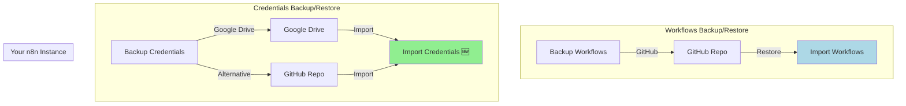

# 📑 N8N Auto-Import Credentials Workflows - Index

## 📂 Файли проекту

### 🎯 Workflows (готові до імпорту в n8n)

| Файл | Опис | Розмір | Для чого |
|------|------|--------|----------|
| **n8n-import-credentials-from-github.json** | Автоматичний імпорт credentials з GitHub | ~10 KB | Імпорт з GitHub repo |
| **n8n-import-credentials-from-google-drive.json** | Автоматичний імпорт credentials з Google Drive | ~11 KB | Імпорт з Google Drive |

### 📚 Документація

| Файл | Мова | Опис | Для кого |
|------|------|------|----------|
| **CREDENTIALS_IMPORT_README.md** | EN | Головний README з повним оглядом | Всі |
| **N8N_CREDENTIALS_IMPORT_GUIDE.md** | EN | Детальна документація, troubleshooting, best practices | Досвідчені користувачі |
| **QUICKSTART_UA.md** | UA | Швидкий старт за 5 хвилин | Початківці |
| **N8N_WORKFLOWS_INDEX.md** | UA/EN | Цей файл - навігація по проекту | Всі |

---

## 🚀 Швидкий старт (за 3 кроки)

### Для новачків:

```
1. 📥 Завантажити: n8n-import-credentials-from-github.json
2. 📖 Прочитати: QUICKSTART_UA.md
3. ▶️ Запустити workflow в n8n
```

### Для досвідчених:

```
1. 📥 Завантажити потрібний workflow (GitHub або Google Drive варіант)
2. 📖 Прочитати: CREDENTIALS_IMPORT_README.md
3. 🔧 Налаштувати згідно документації
4. ▶️ Запустити та автоматизувати
```

---

## 📖 Як читати документацію

### 1️⃣ Перший раз використовуєте?

**Читайте у такому порядку:**

```
QUICKSTART_UA.md (5 хв)
    ↓
Імпортуйте workflow
    ↓
Тестуйте вручну
    ↓
CREDENTIALS_IMPORT_README.md (розділ "Використання")
    ↓
Налаштуйте автоматизацію
```

### 2️⃣ Потрібно детальне розуміння?

```
CREDENTIALS_IMPORT_README.md (повністю)
    ↓
N8N_CREDENTIALS_IMPORT_GUIDE.md (секції що цікавлять)
    ↓
Кастомізуйте під свої потреби
```

### 3️⃣ Виникли проблеми?

```
N8N_CREDENTIALS_IMPORT_GUIDE.md → розділ "Troubleshooting"
    ↓
CREDENTIALS_IMPORT_README.md → розділ "Troubleshooting"
    ↓
Все ще не працює? Перевірте вимоги у QUICKSTART_UA.md
```

---

## 🎯 Що використовувати?

### За джерелом backup:

| Якщо ви зберігаєте credentials в... | Використовуйте workflow... |
|-------------------------------------|----------------------------|
| 🐙 GitHub (private repository) | `n8n-import-credentials-from-github.json` |
| ☁️ Google Drive | `n8n-import-credentials-from-google-drive.json` |
| 🗂️ Інше місце | Модифікуйте GitHub варіант |

### За рівнем досвіду:

| Ваш рівень | Починайте з... |
|------------|-----------------|
| 🌱 Новачок | QUICKSTART_UA.md + GitHub варіант |
| 🌿 Середній | CREDENTIALS_IMPORT_README.md + будь-який варіант |
| 🌳 Експерт | N8N_CREDENTIALS_IMPORT_GUIDE.md + кастомізація |

---

## 📊 Порівняння варіантів

### GitHub vs Google Drive

| Критерій | GitHub | Google Drive |
|----------|--------|--------------|
| **Складність setup** | ⭐⭐ Середня | ⭐⭐⭐ Вища |
| **Швидкість** | ⚡⚡⚡ Швидко | ⚡⚡ Помірно |
| **Версіонування** | ✅ Автоматичне (git) | ⚠️ Вручну |
| **Безпека** | ✅ Добра (private repo) | ✅ Добра (обмежений доступ) |
| **Інтеграція з CI/CD** | ✅ Легко | ❌ Складно |
| **Доступність API** | ✅ 5000 req/год | ✅ Необмежено (з квотами) |
| **Рекомендовано для** | 👨‍💻 DevOps, developers | 👔 Business users |

### Рекомендації:

- 🏆 **GitHub** - якщо у вас є GitHub workflow для backup
- 🏆 **Google Drive** - якщо вже використовуєте Drive для інших backup
- 🏆 **Обидва** - для redundancy (дублювання backup)

---

## 🔗 Повний backup/restore екосистема

Ці workflows доповнюють існуючі:



### Що у вас тепер є:

| # | Функція | Джерело | Існує? |
|---|---------|---------|--------|
| 1 | Backup Workflows | → GitHub | ✅ |
| 2 | Restore Workflows | ← GitHub | ✅ |
| 3 | Backup Credentials | → Google Drive | ✅ |
| 4 | **Import Credentials** | **← GitHub/Drive** | **✅ НОВИЙ!** |

---

## 💡 Типові сценарії використання

### Сценарій 1: Disaster Recovery

```
❌ Ваш n8n instance впав
    ↓
📦 Розгорнули новий instance
    ↓
1️⃣ Import Credentials (цей workflow)
2️⃣ Restore Workflows
    ↓
✅ Система працює знову!
```

**Документація**: N8N_CREDENTIALS_IMPORT_GUIDE.md → "Disaster Recovery Plan"

### Сценарій 2: Міграція між environments

```
🔵 Production → 🟢 Staging
    ↓
1️⃣ Export credentials з Production
2️⃣ Commit до GitHub
3️⃣ Import на Staging (автоматично)
    ↓
✅ Staging оновлено
```

**Документація**: CREDENTIALS_IMPORT_README.md → "Розширення та кастомізація"

### Сценарій 3: Continuous Sync

```
⏰ Schedule: кожні 6 годин
    ↓
🔍 Перевірка змін в GitHub/Drive
    ↓
📥 Автоматичний імпорт нових credentials
    ↓
📬 Notification в Slack
```

**Документація**: N8N_CREDENTIALS_IMPORT_GUIDE.md → "Автоматизація"

### Сценарій 4: Team Collaboration

```
👨‍💻 Developer додає нову інтеграцію
    ↓
💾 Backup credentials → GitHub
    ↓
🔄 CI/CD trigger
    ↓
📥 Auto-import на всі environments
    ↓
👥 Вся команда має доступ
```

**Документація**: CREDENTIALS_IMPORT_README.md → "Інтеграція з CI/CD"

---

## 🛠️ Налаштування під свої потреби

### Хочете змінити джерело backup?

```
1. Базуйтесь на: n8n-import-credentials-from-github.json
2. Замініть node "GitHub Get File" на потрібний (S3, FTP, etc)
3. Документація: N8N_CREDENTIALS_IMPORT_GUIDE.md → "Кастомізація"
```

### Хочете додати notifications?

```
1. Відкрийте workflow
2. Після node "Format Result" додайте Slack/Email node
3. Приклади: CREDENTIALS_IMPORT_README.md → "Моніторинг та Logging"
```

### Хочете вибірковий імпорт?

```
1. Додайте Code node перед "Execute Import"
2. Фільтруйте credentials за type або name
3. Приклад коду: CREDENTIALS_IMPORT_README.md → "Вибірковий імпорт"
```

---

## 🔐 Безпека - читати обов'язково!

### ⚠️ ВАЖЛИВО

Credentials зберігаються в **декодованому вигляді**!

### Мінімальні вимоги безпеки:

```
✅ Private GitHub repository (НЕ public!)
✅ Обмежений доступ до Google Drive папки
✅ 2FA на GitHub/Google accounts
✅ Регулярна ротація API keys
```

### Детальніше:

- **Базова безпека**: QUICKSTART_UA.md → "ВАЖЛИВО: Безпека"
- **Розширена безпека**: CREDENTIALS_IMPORT_README.md → "Безпека"
- **Best practices**: N8N_CREDENTIALS_IMPORT_GUIDE.md → "Best Practices"

---

## 📈 Статистика проекту

| Метрика | Значення |
|---------|----------|
| **Кількість workflows** | 2 |
| **Підтримувані джерела** | GitHub, Google Drive |
| **Документація (сторінок)** | 4 файли, ~50 KB |
| **Мови документації** | English, Українська |
| **Nodes у workflow** | 15-17 на кожен |
| **Час setup** | 3-10 хвилин |
| **Рівень складності** | Початковий-середній |

---

## 🤝 Contributing та підтримка

### Знайшли баг?

1. Перевірте troubleshooting в документації
2. Створіть issue з детальним описом
3. Додайте логи з node "Format Result"

### Маєте пропозицію?

1. Створіть feature request
2. Опишіть use case
3. Запропонуйте implementation (опціонально)

### Хочете покращити документацію?

1. Fork repository
2. Оновіть відповідний .md файл
3. Створіть Pull Request

---

## 📞 Контакти та ресурси

### Офіційна документація n8n:

- 🌐 [n8n Documentation](https://docs.n8n.io/)
- 📖 [CLI Commands](https://docs.n8n.io/hosting/cli-commands/)
- 🔐 [Credentials](https://docs.n8n.io/credentials/)

### Community:

- 💬 [n8n Community Forum](https://community.n8n.io/)
- 🐙 [GitHub Discussions](https://github.com/n8n-io/n8n/discussions)
- 💭 [Discord Server](https://discord.gg/n8n)

### API Documentation:

- 📘 [GitHub REST API](https://docs.github.com/en/rest)
- 📗 [Google Drive API](https://developers.google.com/drive/api/v3/about-sdk)

---

## 🎓 Навчальні матеріали

### Для початківців:

1. **QUICKSTART_UA.md** - Починайте тут! (5 хвилин)
2. **CREDENTIALS_IMPORT_README.md** → "Швидкий старт" (10 хвилин)
3. Практика: імпортуйте workflow та протестуйте вручну
4. **QUICKSTART_UA.md** → "Автоматизація" (5 хвилин)

**Загальний час**: 30-60 хвилин до повної автоматизації ✅

### Для middle рівня:

1. **CREDENTIALS_IMPORT_README.md** (повністю, 30 хвилин)
2. **N8N_CREDENTIALS_IMPORT_GUIDE.md** → розділи що цікавлять (30 хвилин)
3. Практика: налаштуйте обидва варіанти (GitHub + Drive)
4. Додайте notifications та моніторинг

**Загальний час**: 2-3 години до production-ready setup ✅

### Для експертів:

1. Швидко проскануйте всю документацію (15 хвилин)
2. Модифікуйте під свої потреби
3. Інтегруйте з CI/CD
4. Додайте advanced features (версіонування, rollback, etc)

**Загальний час**: залежить від requirements ⚡

---

## 📝 Чеклист для початку роботи

### Перед початком:

- [ ] Маю backup credentials file (експортований з n8n)
- [ ] Маю GitHub account або Google Drive
- [ ] Маю доступ до n8n instance (self-hosted або cloud)
- [ ] Node.js встановлено (для `npx` команд)

### Setup:

- [ ] Завантажив потрібний workflow .json файл
- [ ] Прочитав QUICKSTART_UA.md або CREDENTIALS_IMPORT_README.md
- [ ] Створив GitHub token / налаштував Google Drive OAuth
- [ ] Імпортував workflow в n8n
- [ ] Налаштував node "Globals - Config"
- [ ] Додав credentials (GitHub API / Google Drive)

### Тестування:

- [ ] Запустив workflow вручну (Manual Trigger)
- [ ] Перевірив output у "Format Result" node
- [ ] Підтвердив що credentials з'явились у n8n
- [ ] Протестував один з credentials (працює?)

### Автоматизація:

- [ ] Активував Schedule Trigger (опціонально)
- [ ] Налаштував потрібний інтервал
- [ ] Додав notifications (опціонально)
- [ ] Задокументував процес для команди

### Готово! 🎉

---

## 🗺️ Roadmap та майбутні покращення

### Планується:

- [ ] Support для інших storage (AWS S3, Azure Blob, etc)
- [ ] Web UI для управління imports
- [ ] Automatic conflict resolution
- [ ] Credentials versioning та rollback
- [ ] Multi-instance sync
- [ ] Audit logging та compliance reports

### Хочете допомогти?

Contributions are welcome! See CREDENTIALS_IMPORT_README.md → "Contributing"

---

## 🏆 Success Stories

### Використовуєте ці workflows?

Поділіться своїм досвідом:
- Як використовуєте?
- Які покращення додали?
- Які проблеми вирішили?

---

## ⚖️ License

Workflows та documentation:
- Free to use and modify
- Based on n8n ecosystem
- See n8n license for details

---

## 📌 Версія документації

| Метрика | Значення |
|---------|----------|
| **Версія** | 1.0.0 |
| **Дата створення** | 2024-01-15 |
| **Остання оновлення** | 2024-01-15 |
| **Автор** | Based on community workflows |
| **Статус** | ✅ Production Ready |

---

## 🎯 Що далі?

### Ви прочитали цей index?

**Новачок?**
```
→ Читайте QUICKSTART_UA.md зараз!
```

**Досвідчений?**
```
→ Відкривайте CREDENTIALS_IMPORT_README.md
```

**Експерт?**
```
→ Завантажуйте workflow та кастомізуйте під себе
→ Питання? N8N_CREDENTIALS_IMPORT_GUIDE.md має відповіді
```

---

**🎉 Дякуємо що використовуєте наші workflows!**

**Made with ❤️ for n8n community**

---

**💬 Feedback appreciated!**
Залишайте коментарі, issues, pull requests - ми постійно покращуємо документацію та workflows.

---

_Last updated: 2024-01-15_
_Document version: 1.0.0_
_Maintained by: n8n community_

